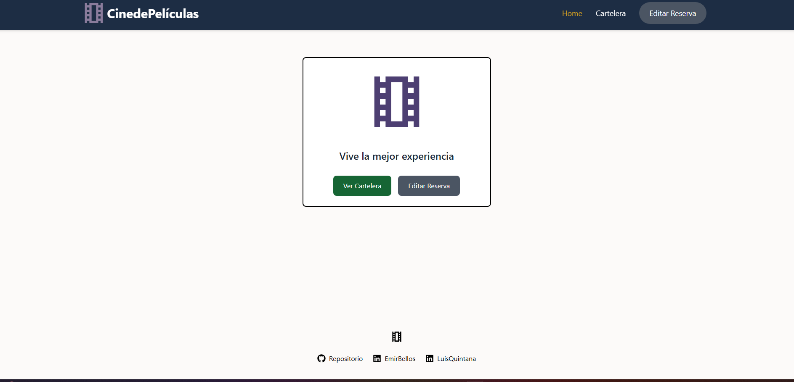
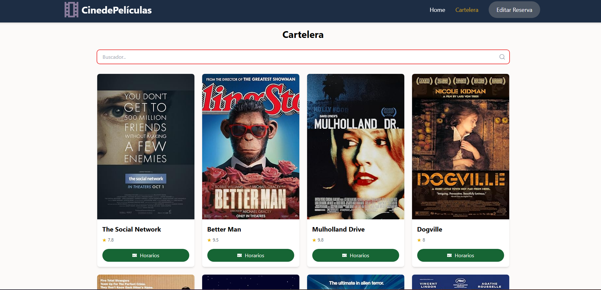
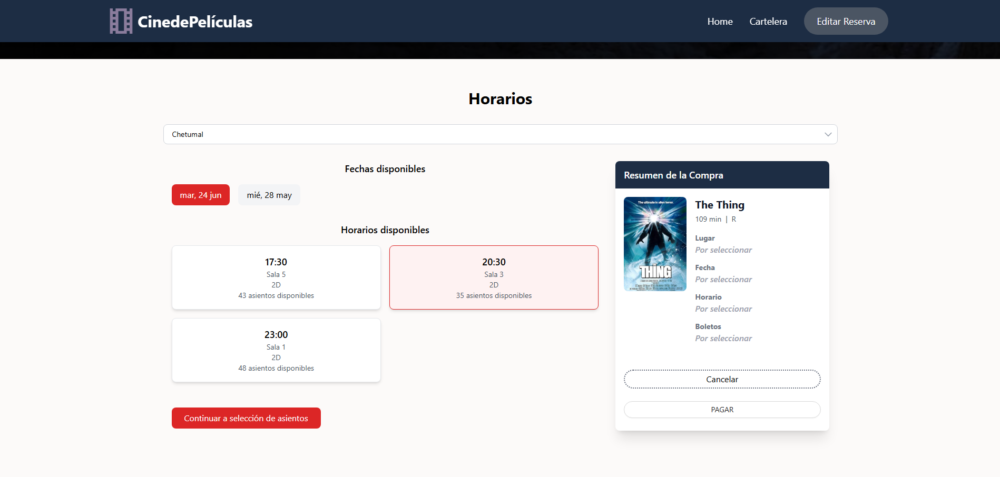
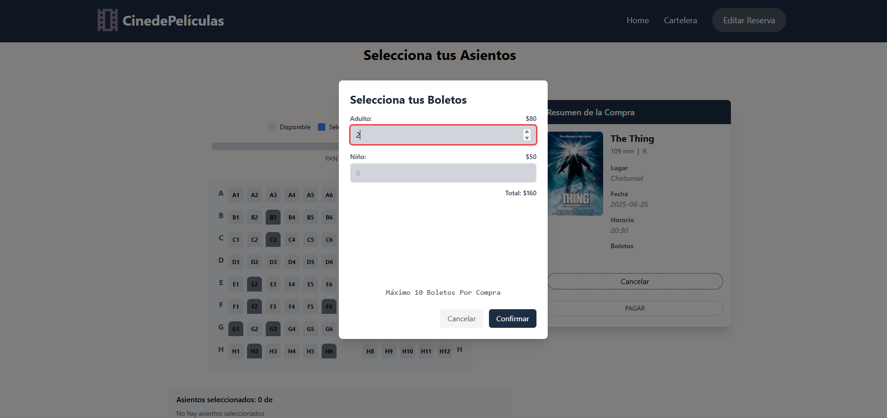
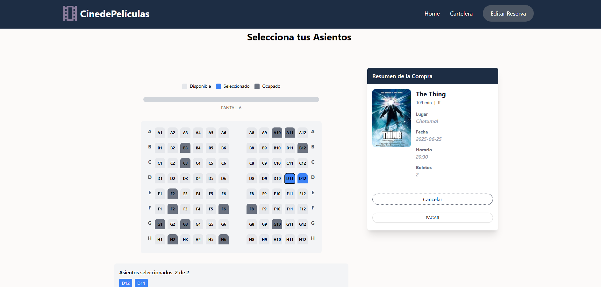
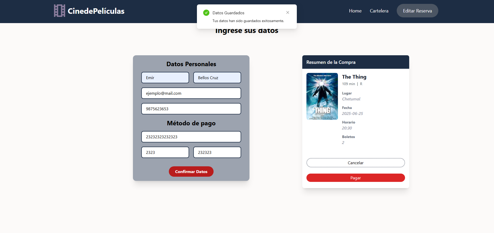
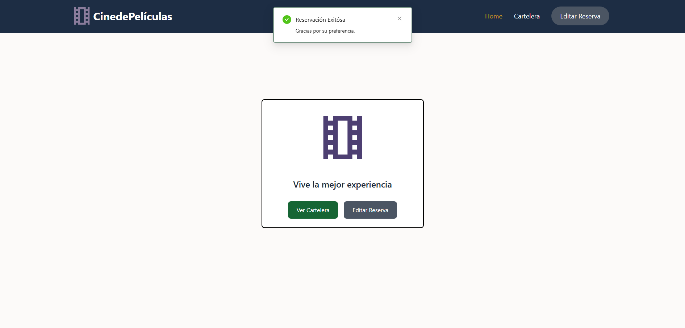

# Cinema-Project Frontend

## Introducción

Este documento describe el desarrollo y la gestión del frontend del proyecto Cinema-Project, el cual está diseñado para ofrecer una experiencia de usuario dinámica y responsiva para el sistema de reservas de cine.

## Tecnologías Utilizadas

- **React.js:**  
  Utilizado para crear la interfaz de usuario dinámica y responsiva.

- **APIs REST:**  
  Proporcionan la comunicación del frontend con el backend, gestionando solicitudes y respuestas de manera eficiente.

## Funcionalidades Principales

- Visualización de películas y horarios.
- Reservación de asientos en tiempo real.

## Configuración y Ejecución

1. Clona el repositorio del proyecto:
   ```bash
   git clone <url-del-repositorio>

2. Instala las dependencias necesarias:
    ```bash
    npm install
*Asegurate de estar dentro de la carpeta Frontend en tu terminal*

3. Ejecuta el servidor de desarrollo
    ```bash
    npm start

## Vistas del proyecto

- **Home:**

*Menú principal con botónes para ir a cartelera, un header para la navegación, y un footer con ipervinculo a este repositorio.*

- **Cartelera:**

*Barra de búsqueda, y una lista de cards de películas con información relevante, estas cards contienen un botón para ir a la sección Selección de Horarios.*

- **Seleccionar Horarios:**

*Barra para seleccionar ciudad, lista de horarios que se despliega al seleccionar una fecha, además de un Info Card para visualizar el progreso de la reserva*

- **Seleccionar Boletos:**

*Modal para seleccionar la cantidad de boletos y visualizar el monto total*

- **Seleccionar Asientos:**

*Sección con asientos disponibles y ocupados, contiene una sección que muetra los asientos seleccionados y los restantes correspondiendo a la cantidad de boletos ingresados, Info Card actualizada y con botón 'pagar' bloqueado hasta terminar la reserva*

- **Ingresar Datos del Cliente:**

*Formulario para ingresar datos personales y relevantes para guardar la reserva, además del método de pago necesario para continuar, Info Card actualizada y con botón 'pagar' habilitado.*

- **Reserva completada con éxito:**

*Redireccionamiento a la vista Home con una Notificación que indica el termino éxitoso de la reserva*